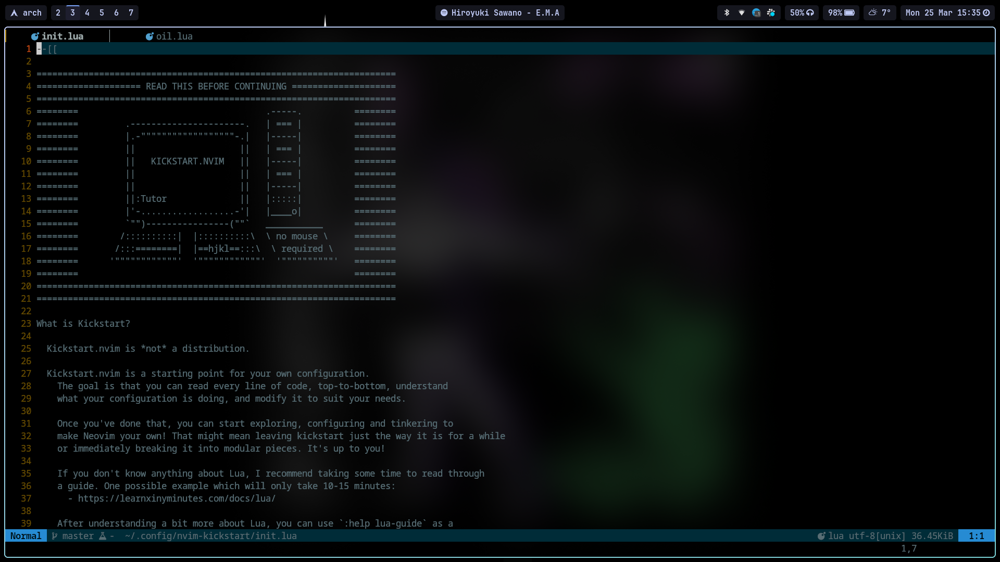

# nochzato's neovim config

Based on TJ's [kickstart.nvim](https://github.com/nvim-lua/kickstart.nvim)

## Language support:
- TypeScript, JavaScript
    - LSP: vtsls
    - Formatter: prettierd
    - Linter: eslint-lsp
- Go
    - LSP: gopls
    - Formatters: gomodifytags, gofumpt, iferr, impl, goimports
- Python
    - LSP: pyright
    - Formatter: black

## Notable plugins:
- File Explorer: [oil.nvim](https://github.com/stevearc/oil.nvim)
- Bufferline: [bufferline.nvim](https://github.com/akinsho/bufferline.nvim)
- Lsp Extension: [lspsaga.nvim](https://github.com/nvimdev/lspsaga.nvim)

## Colorscheme
Colorscheme is [solarized-osaka.nvim](https://github.com/craftzdog/solarized-osaka.nvim). I tweaked it so all borders (telescope floats, cmp floats, etc.) have the same color
